 # 前言

本库主要是介绍如何使用亚马逊云服务搭建自己的Shadowsocks服务器，由于是个人服务器，一般情况下不会被封；你也可以和自己信任的人一起使用，网上Shadowsocks的教程太多而且很多已经过时，很多已经不使用不了，或者浪费了大半天时间，最后发现用不了，本教程手把手教大家从0开始，搭建一个可使用的shadowsocks服务器。

# 开始

## 注册邮箱

无论是使用亚马逊云（AWS) 还是微软云（Azure) 都需要使用邮箱， 这里推荐使用的是Gmail 或 hotmail, 当然，国内的邮箱也可以，Gmail注册相对复杂一下，这里就以hotmail 为例子示范

### 1、进入首页，

首先进入 [Outlook 首页](https://www.microsoft.com/zh-cn/microsoft-365/outlook/email-and-calendar-software-microsoft-outlook)
点击创建免费账户进行注册


### 2、填为邮件名，选择 @hotmail.com


### 3、输入密码

### 4、输入个人信息


### 5、注册成功,登录邮箱


## 注册亚马逊云（AWS) 账户

注册亚马逊云账户，亚马逊有新手12个月免费的套餐，所以如果你的邮箱是新的，没注册过的亚马逊的， 则有12个月免费的Ec2 使用期，每个月有750个小时（约31天）的服务器使用时间，还有100G的宽带流量（出网流量），如果是我们个人使用，一般都不会超的，足够我们日常使用了， 也就是说，我们能白嫖亚马逊12个月，当然12月后如果继续使用，会按使用量扣费的，如果只想白嫖，那请紧记要在免费期结束之前把实例给终止了。


### 1、注册并登录
1.1 进入[亚马逊云注册首页](https://signin.aws.amazon.com/signup?request_type=register)

左侧有介绍关于免费套餐的内容，可以点击进去详情， 右侧是我们注册账户需要录入的信息。


1.2 填入邮件地址与账户名称后，点击 [Verify email addresss] 按钮，然后会向你的邮箱发送验证码，打开的你的邮箱查看验证码，按提示录入并确认


1.3 最后提示你的电子邮件地址验证成功， 这时要要求你创建Root 密码


1.4 下一步，录入个人信息

1.5 这一步，要填入账单信息，也就是要写付款的卡片信息，这里只支持外币卡，如visa或masterCard ， 国内银联是不支持的。亚马逊是后付款的，所以如果用超了免费套餐的量，就会出账单并从这卡里扣款。


1.6 填完卡片信息后， 会要求验证电话号码， 这里填国内的电话即可


1.7 验证完成后，最后一步，选择支持计划， 我们选择最左边的基本支持即可，点击完成注册， 因为我们是用来做shadowsocks服务的，一般情况都不需要支持服务


### 2、创建实例

注册完成后，我们就可以进入亚马逊的控制台了，亚马逊的全球多个地区都有服务器，所以这里你需要想好你要在哪个地区创建你的vps , 因为不同地区的政策不一样， 网速也不一起，如果你是要做跨境电商的， 那要考虑你的目标市场在哪里，最好就在你的目标市场的地区搭建vps, 如果你只是为了科学上网，那网速是你的首选，按照我的经验，在国内连接亚太地区的香港、新加坡、日本会比较快，但由于香港也被西方限制了不少， 例如GPT就限制了香港的使用，币安在日本也被限制，所以目前综合来说，新加坡是国内出墙最好的选择！


2.1 进入控制台， 选择要创建实例的地区（注意：免费的套餐是每月750个小时，也就是750/24 =31.25天，也就是说，只够开一个实例）这里选择新加坡作为创建服务器实例的地区


2.2 进入新加坡区域后，点击EC2， 进入服务器实例配置页面


2.3 选择实例


2.4 启动新实例


2.5 进入配置页面

名称可填可不填，如果你配置多台服务器，用不同的名称好区分， 但我们如果只用一台，那不需要命名也行
主要的是下方的AMI(系统映像)， 有很多镜像是不适用的，或者是需要安装额外的插件才能用起来的。这里试了很多AMI, 发现了还是centos7镜最好用，AMI:  ami-09e2a570cb404b37e, 在搜索框输入 ami-09e2a570cb404b37e，搜索，选择即可


2.6 选完AMI 后，下一步是选择实例类型，点开下拉框，选择t2.micro, 可以看到，此类型的右边有标注：符合条件的免费套餐， 表明这个类型是可以使用免费套餐的，如果没有标注的， 则不能使用免费套餐， 创建之后会按时间进行收费
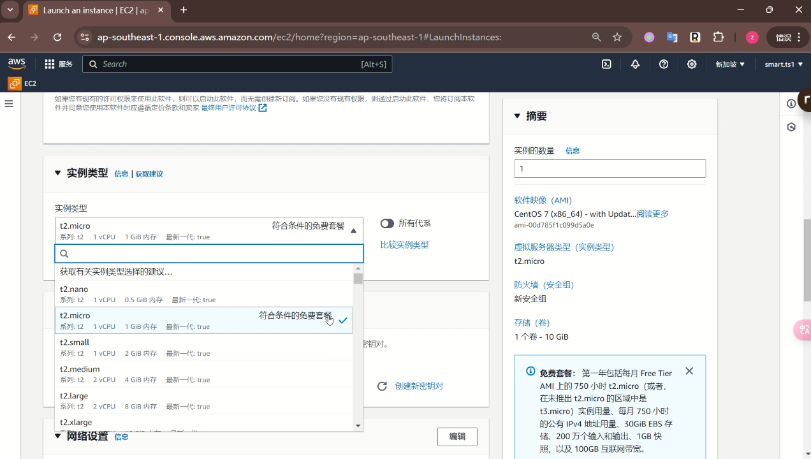

2.7 接下来我们需要创建密钥对，由于新用户是没有密钥对的， 所以需要创建密钥对， 这里的密钥是用来登录服务器的，就是我们创建实例后， 可以通过xshell 等工具ssh连接到服务器上时用到的。创建时，写个名称，会自动下载到你本地，注意小心保存起来
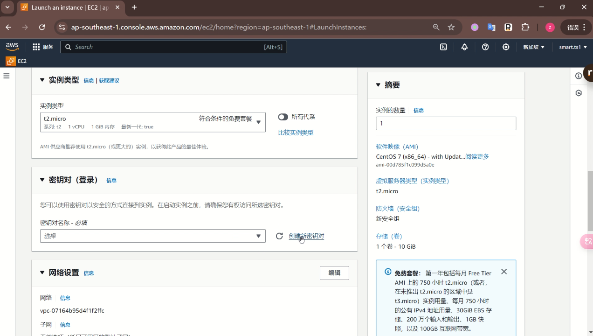
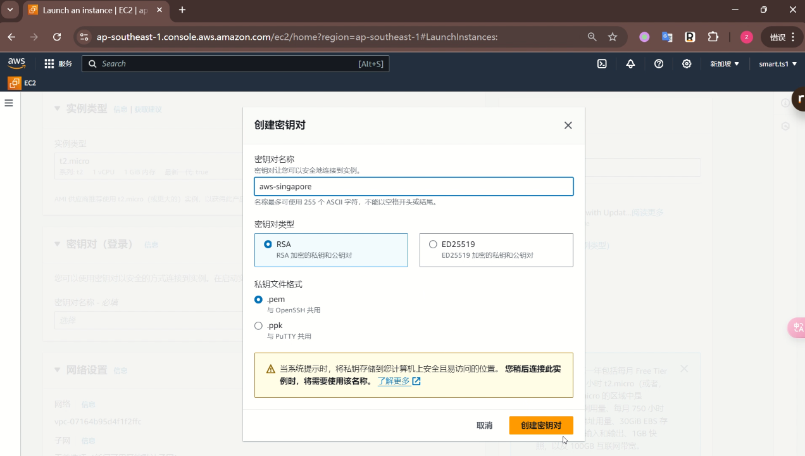
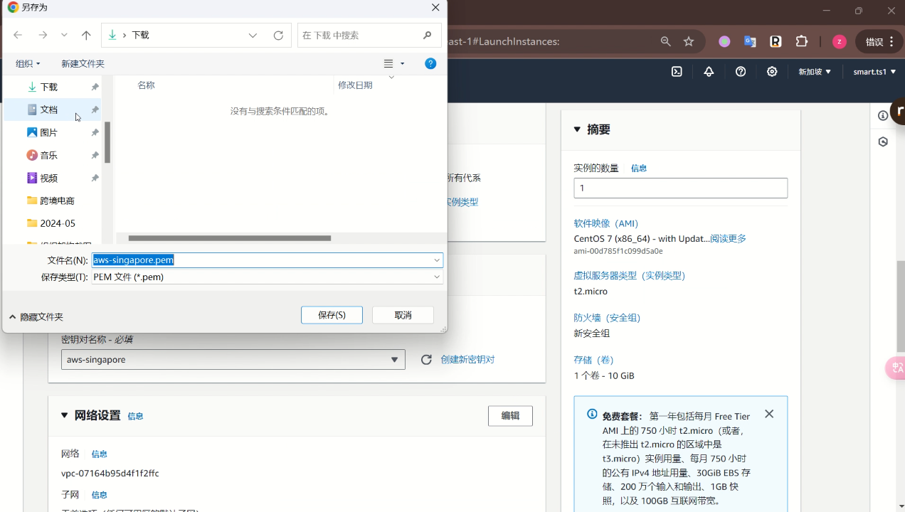

2.8 接下来就是网络设置，不需要动，直接使用默认的就行
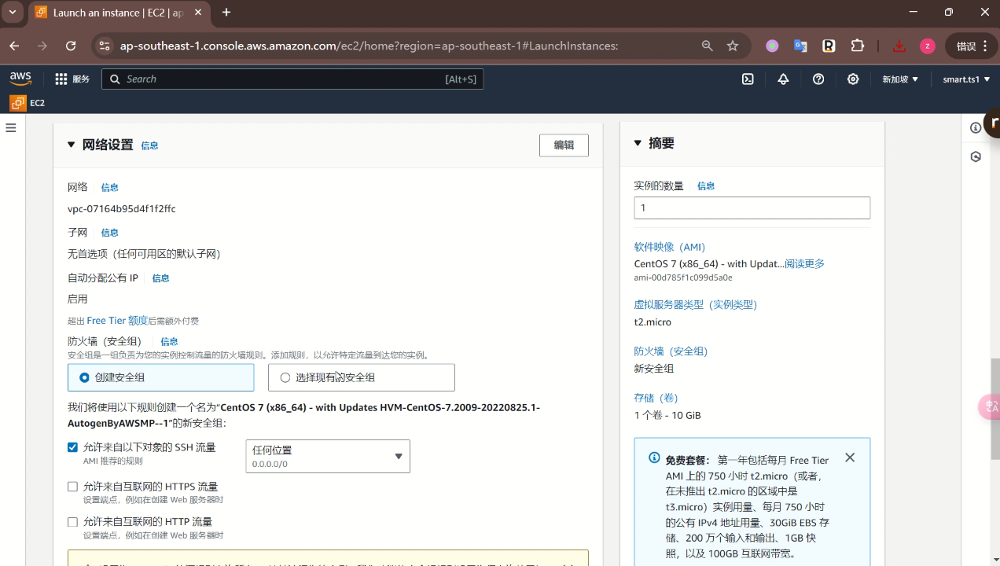

2.9 最后配置存储，就是硬盘大小， 由于免费套餐是包含30G 的， 所以我们这里更改为30GB 的硬盘，配置好后，点击右下角的启动实例按钮
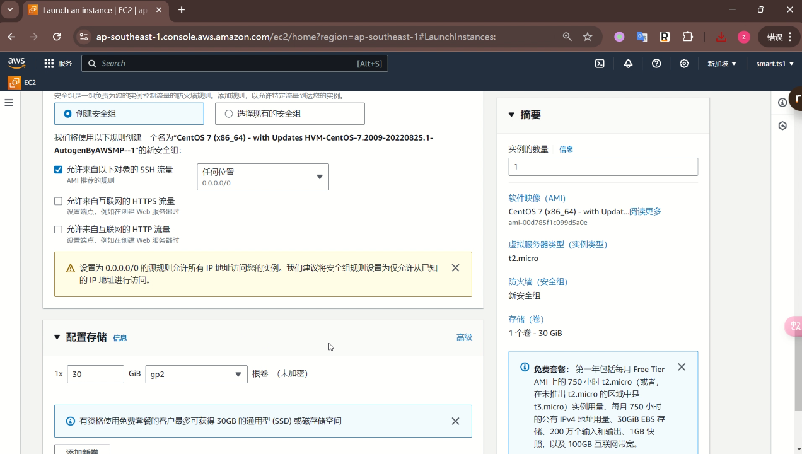

2.10 启动实例完成后，选择查看所有实例，然后点开刚创建的实例，找到实例的公网IP， 这个IP就是你的vps的公网IP。
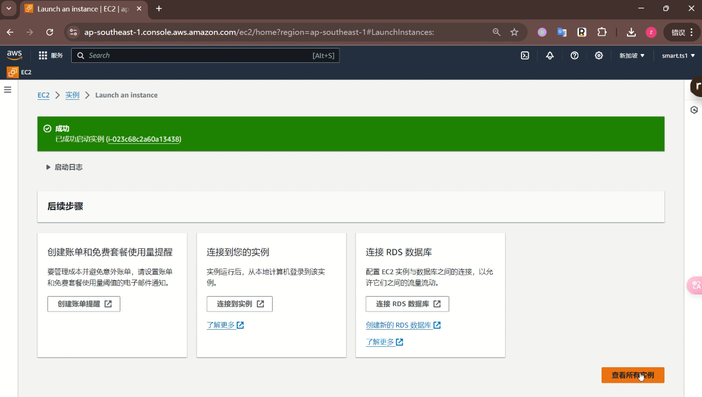
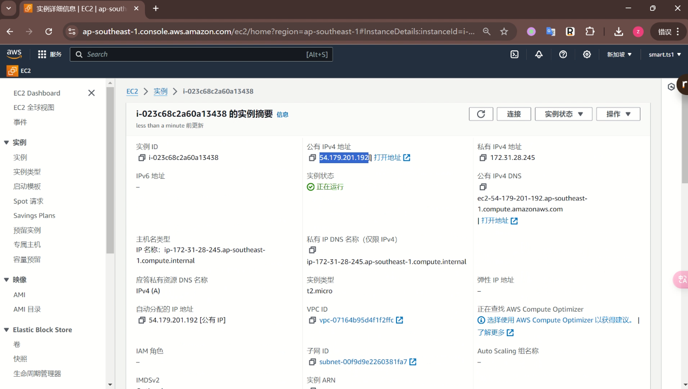

2.11 接下来，可以使用xshell 进行连接， xshell 可以去官网下载，使用上面的公网IP 进行连接， 用户名默认为：centos, 身份验证方法选择Public Key,
密钥就使用2.7 创建的密钥后保存到本地的私钥文件即可，配置好就可以连接了

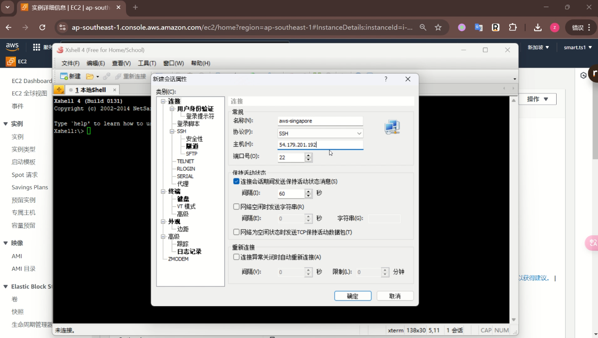
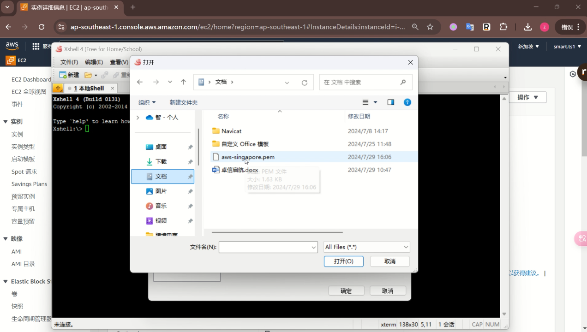


### 3、搭建shadowsocks服务

3.1 连接到服务器后，先变更为root用户，因为很多地方需要root权限，因为centos7已经停止维护，原来的yum源已经不可用，所以需要先变更系统的yum 源，输入以下命令：
```
#变更root用户
sudo su - root
#变更yum的源，更新为阿里的源
curl -o /etc/yum.repos.d/CentOS-Base.repo http://mirrors.aliyun.com/repo/Centos-7.repo

#安装wget 
yum install -y wget

```
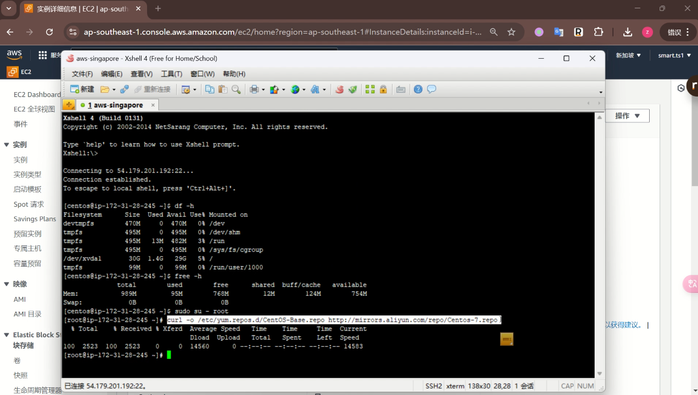

3.2 下载安装shadowsocks的脚本，并执行安装
```
##下载脚本文件
wget --no-check-certificate -O shadowsocks-all.sh https://raw.githubusercontent.com/uncle-pro/Shadowsocks-AWS-Tutorial/main/script/shadowsocks-all.sh

#给脚本增加可执行的权限
chmod +x shadowsocks-all.sh

#执行脚本
./shadowsocks-all.sh 2>&1 | tee shadowsocks-all.log

```
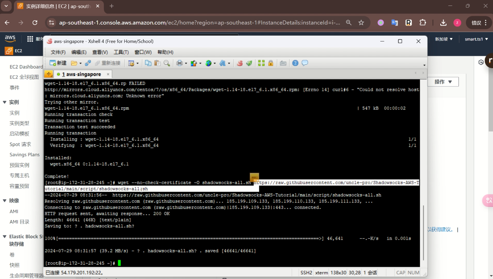

3.3 按脚本的提示，选择参数就行了

选择服务类型，这里使用Shadowsocks-libev , 输入4 , 回车 
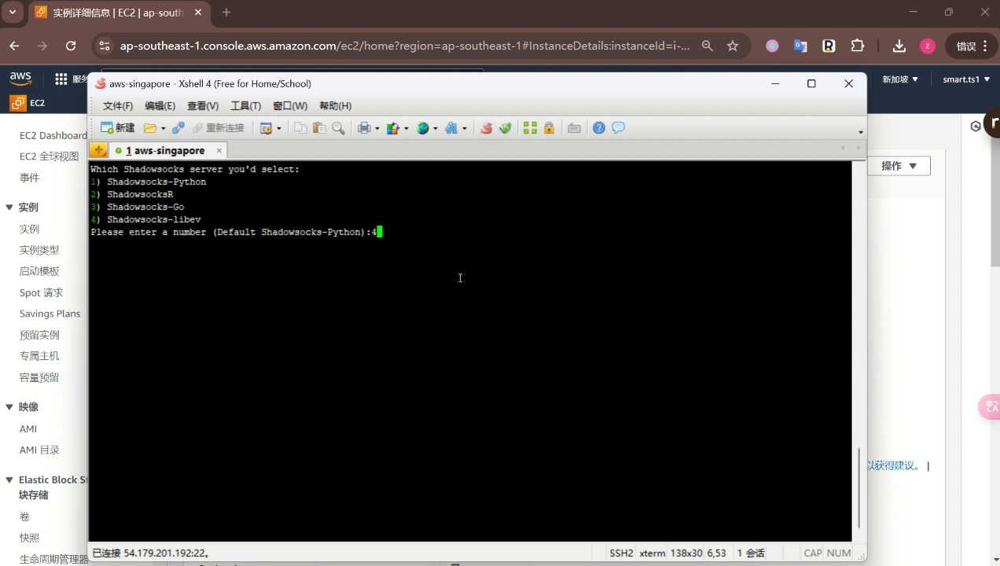
输入密码，输入自己想要设置的密码，回车
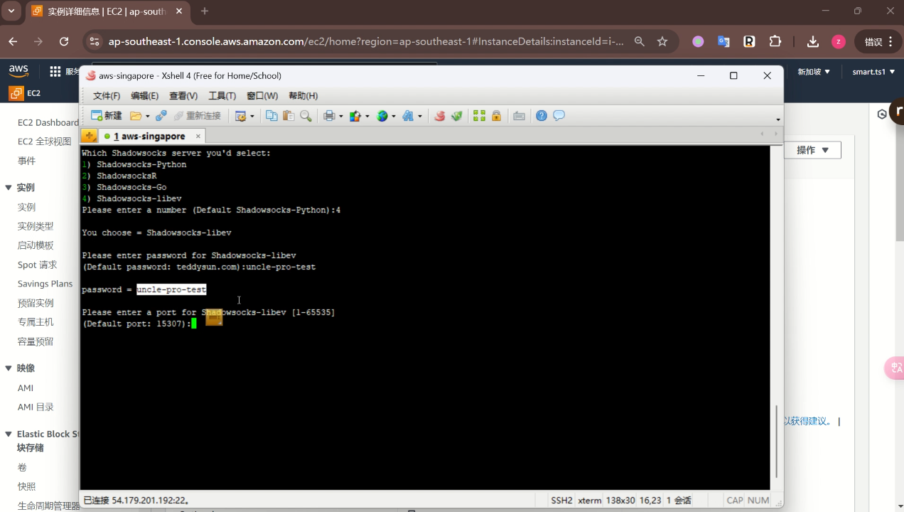
输入端口号， 自定义， 如：48898
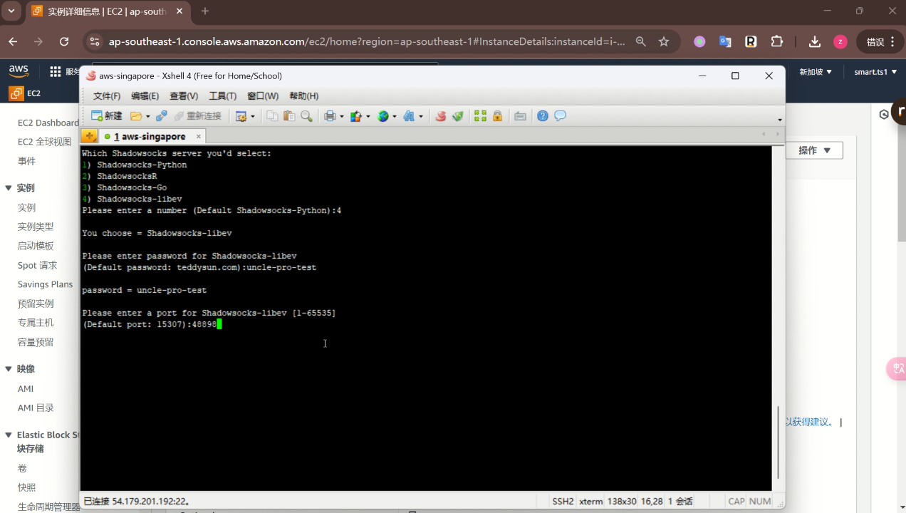
选择加密算法，这里推荐选择xchacha20-ietf-poly1305, 所以输入13， 回车
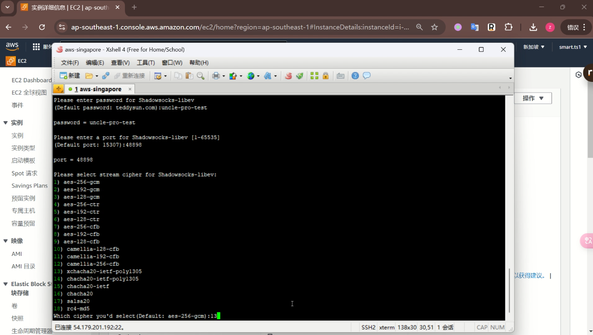

3.4 执行过程中， 都选择默认值，直接回车（两次回车即可)，完成后会提示，并显示出来shadowsocks的连接方式，
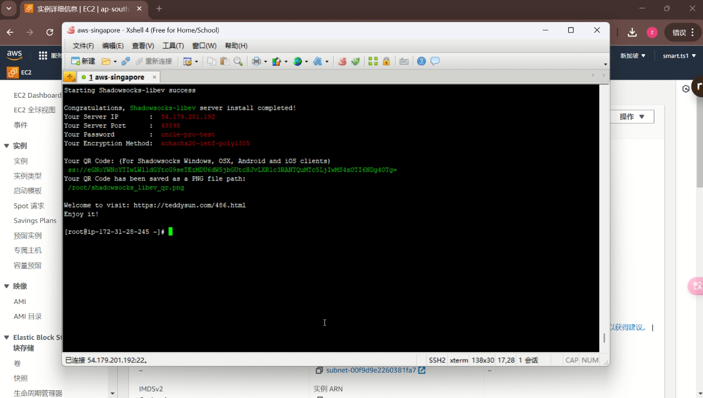

3.5 由于我们这里使用的是48898 端口，亚马逊云服务器默认是关闭所有端口访问的， 所以最后还需要回到亚马逊云控制台， 打开安全组，设置防火墙，在入站规则里添加TCP 的48898端口的
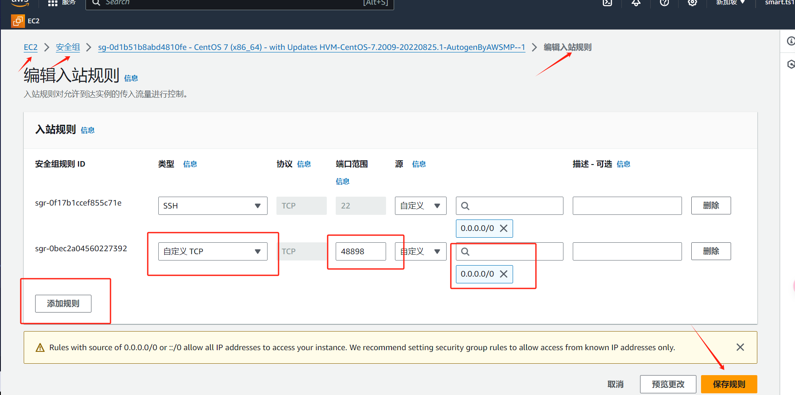

3.6 shadowsocks 的常用命令

start 启动 stop 停止 restart 重启 status 状态
```
/etc/init.d/shadowsocks-libev start
/etc/init.d/shadowsocks-libev stop
/etc/init.d/shadowsocks-libev restart
/etc/init.d/shadowsocks-libev status
```
卸载命令
```
./shadowsocks-all.sh uninstall
```

### 4、安装shadowsocks 客户端

4.1 下载 PC 端的客户端或手机端的客户端， 安装后按提示配置连接信息，在需要翻墙的时候，先连接shadowsocks ，你的设备就能通过亚马逊云的EC2 服务器进行翻墙访问了

下面是各个终端的下载地址（用过Windows,MAC,Android,IOS操作起来都是差不多的）：

Windows：https://github.com/shadowsocks/shadowsocks-windows/releases

Android:https://github.com/shadowsocks/shadowsocks-android/releases

MAC:https://github.com/shadowsocks/ShadowsocksX-NG/releases

Linux:https://github.com/shadowsocks/shadowsocks-qt5/wiki/Installation

IOS:

由于国区APP下架VPN类APP，包括支持ss类的APP，所以需要切换账号

建议注册一个国外账号，不要国内账号换区，这样既可以需要下载国内APP时切换国区账号，需要下载国外APP时切换外区账号。


